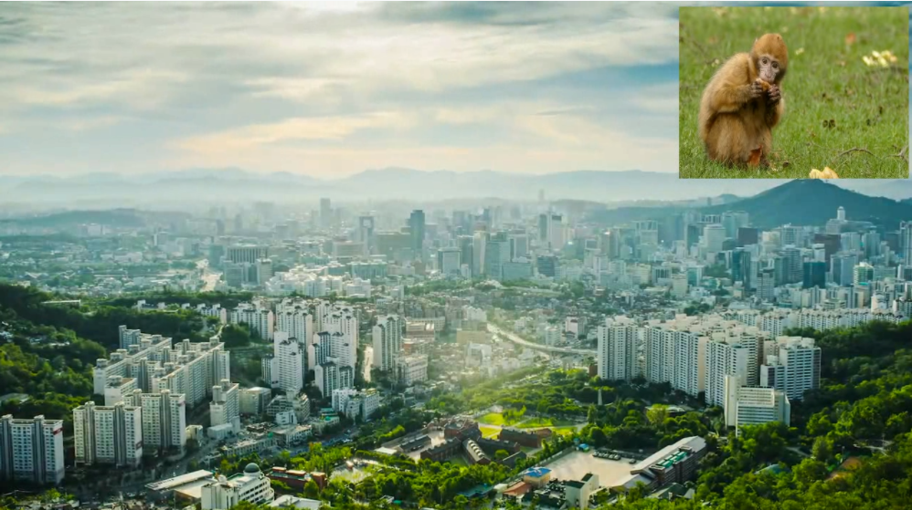
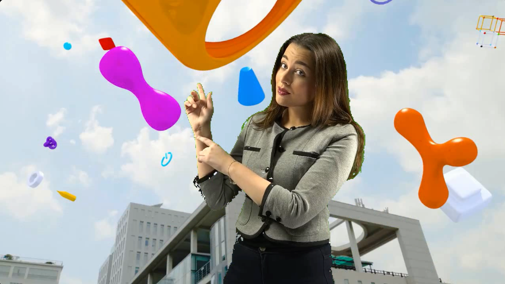
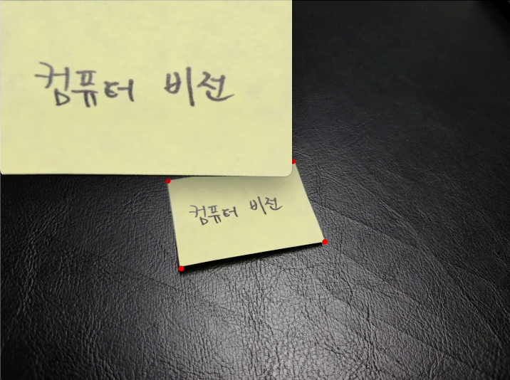
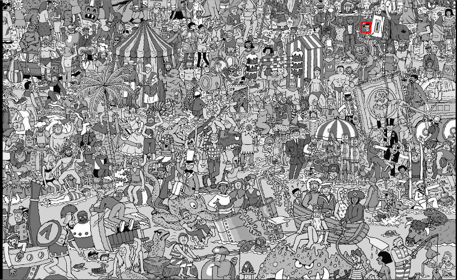
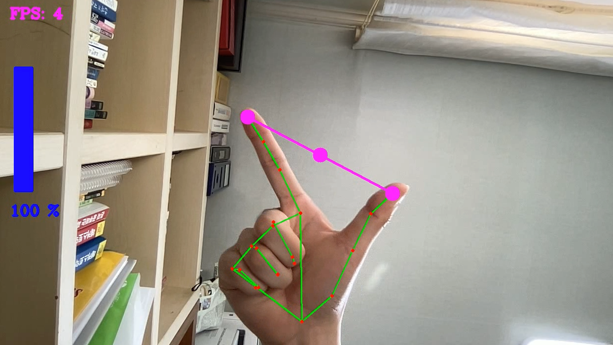

# OpenCV 프로젝트

## 1. Merge two videos [[Link]](https://github.com/kimkj38/openCV_projects/tree/master/1.%20Merge_two_-videos)

## 2. Croma key [[Link]](https://github.com/kimkj38/openCV_projects/tree/master/2.%20Croma_key)

## 3. Perspective transformation [[Link]](https://github.com/kimkj38/openCV_projects/tree/master/3.%20Persopective_transformation)

## 4. Find wally [[Link]](https://github.com/kimkj38/openCV_projects/tree/master/4.find_wally)

## 5. Volume Control [[Link]](https://github.com/kimkj38/openCV_projects/tree/master/Volume_control)

